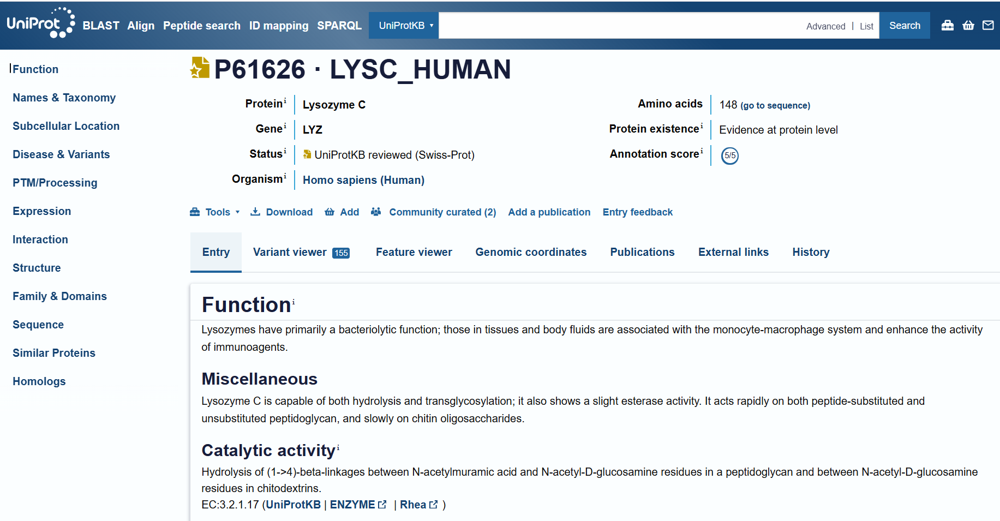
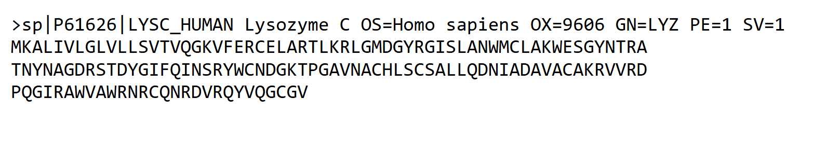
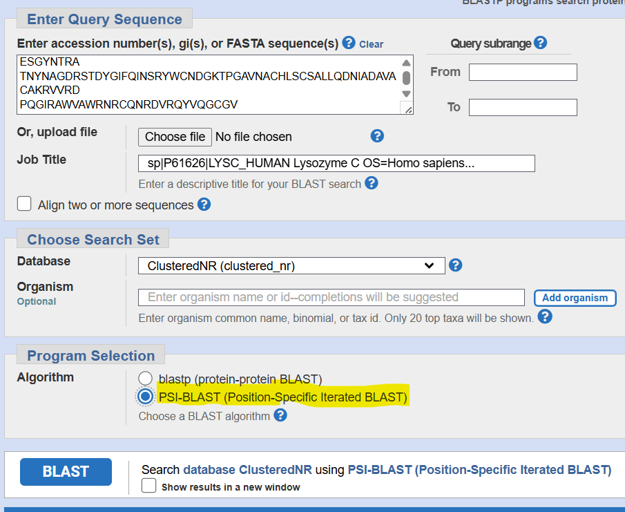

# Experiment 2: PSI-BLAST Analysis of Lysozyme C

## Aim

To utilize Position-Specific Iterative BLAST (PSI-BLAST) to identify homologous sequences of a given query protein sequence and analyze their similarity across multiple iterations.

---

## Query Protein

| Parameter | Details |
|---|---|
| Protein | Lysozyme C |
| Gene | LYZ |
| Organism | Homo sapiens (Human) |
| UniProt Accession | P61626 |
| UniProt ID | LYSC_HUMAN |
| Protein Length | 148 amino acids |
| Protein Existence | Evidence at protein level |
| UniProt Status | Reviewed (Swiss-Prot) |

---

## Introduction

PSI-BLAST (Position-Specific Iterated BLAST) is a sequence similarity searching method used to identify homologous proteins, including more distantly related sequences that may not be detected easily using a single standard BLAST search.

Unlike a conventional BLAST search, PSI-BLAST generates a Position-Specific Scoring Matrix (PSSM) from significant hits obtained during the initial search. The PSSM is then used in subsequent iterations to identify additional related sequences.

In this experiment, the human Lysozyme C protein sequence was used as the query for PSI-BLAST analysis.

---

## Principle

The PSI-BLAST analysis begins with a protein sequence search against a protein sequence database. Significant matches from the first iteration are used to construct a Position-Specific Scoring Matrix (PSSM).

The PSSM contains position-specific information about amino-acid conservation and substitution. It is then used in subsequent iterations to detect additional homologous sequences.

The results can be evaluated using parameters such as:

- E-value
- Percentage identity
- Query coverage
- Alignment score
- Newly identified homologous sequences

A lower E-value indicates a more statistically significant match.

---

## Tools and Databases Used

- **UniProt** – retrieval of the query protein sequence
- **NCBI BLAST / PSI-BLAST** – iterative protein sequence similarity search
- **ClusteredNR (clustered_nr)** – database selected in the PSI-BLAST search
- **Protein FASTA sequence** – query input

---

## PSI-BLAST Search Parameters

| Parameter | Value |
|---|---|
| Search Program | PSI-BLAST |
| Query | Lysozyme C |
| Accession | P61626 |
| Organism | Homo sapiens |
| Database | ClusteredNR (clustered_nr) |
| Search Type | Protein-protein BLAST |
| Number of Iterations | 3 |
| Number of Sequences | 500 |

---

## Procedure

### Step 1: Retrieval of Query Protein

The human Lysozyme C protein was searched in the UniProt database.

The selected protein record was:

- **Protein:** Lysozyme C
- **Gene:** LYZ
- **Organism:** Homo sapiens
- **UniProt Accession:** P61626
- **Protein length:** 148 amino acids

Screenshot:

---

### Step 2: Retrieval of FASTA Sequence

The FASTA sequence of human Lysozyme C was obtained from the UniProt record.

The sequence contains **148 amino acids** and was used as the query sequence for PSI-BLAST.

Screenshot:

---

### Step 3: PSI-BLAST Input

The Lysozyme C protein sequence was entered into the NCBI BLAST interface.

The **PSI-BLAST (Position-Specific Iterated BLAST)** option was selected. The search database shown in the submitted search was **ClusteredNR (clustered_nr)**.

Screenshot:

---

## PSI-BLAST Results

### Iteration 1

The first PSI-BLAST iteration produced significant matches to Lysozyme C and related lysozyme sequences.

Some representative hits observed in the results include:

| Protein | Organism | Query Coverage | E-value | Percentage Identity |
|---|---|---:|---:|---:|
| Lysozyme C precursor | *Gorilla gorilla gorilla* | 100% | 3e-103 | 99.32% |
| Lysozyme C precursor | *Macaca mulatta* | 100% | 2e-94 | 88.51% |
| Mdc-hly hybrid protein | Synthetic construct | 88% | 1e-91 | 100.00% |
| Predicted Lysozyme C | *Chrysochloris asiatica* | 100% | 1e-91 | 86.49% |
| Lysozyme C | *Taphozous melanopogon* | 100% | 3e-91 | 83.78% |

The results showed high sequence similarity between human Lysozyme C and several homologous lysozyme proteins.

Screenshot:

---

### Iteration 2

The second iteration generated additional significant matches and refined the sequence profile using the PSSM generated during the PSI-BLAST analysis.

Representative results included:

| Protein | Organism | Query Coverage | E-value | Percentage Identity |
|---|---|---:|---:|---:|
| Lysozyme C | *Taphozous melanopogon* | 100% | 2e-116 | 83.78% |
| c-type lysozyme | *Leptonycteris yerbabuenae* | 100% | 2e-116 | 86.49% |
| Predicted Lysozyme C | *Chrysochloris asiatica* | 100% | 8e-115 | 86.49% |
| Lysozyme C precursor | *Macaca mulatta* | 100% | 3e-114 | 88.51% |
| Lysozyme C | *Rhinopoma microphyllum* | 100% | 5e-113 | 80.41% |

The results continued to show highly significant similarity among lysozyme sequences from different organisms.

Screenshot:

---

### Iteration 3

The third iteration produced clustered sequence results representing multiple organisms.

Representative results included:

| Cluster Representative | Query Coverage | E-value | Percentage Identity |
|---|---:|---:|---:|
| Lysozyme C - *Taphozous melanopogon* | 100% | 6e-115 | 83.78% |
| c-type lysozyme - *Leptonycteris yerbabuenae* | 100% | 2e-114 | 86.49% |
| Predicted Lysozyme C - *Chrysochloris asiatica* | 100% | 1e-112 | 86.49% |
| Lysozyme C precursor - *Macaca mulatta* | 100% | 1e-111 | 88.51% |
| Lysozyme C - *Rhinopoma microphyllum* | 100% | 3e-111 | 80.41% |
| Lysozyme C - *Talpa occidentalis* | 100% | 9e-111 | 81.08% |

The third iteration continued to identify strongly conserved lysozyme-related sequences across different organisms.

Screenshot:

---

## Observations

The PSI-BLAST analysis showed that human Lysozyme C has highly similar homologous sequences in several organisms.

The observed results showed:

- High query coverage, generally around **100%** for the major hits.
- High percentage identity, with several sequences showing more than **80% identity**.
- Very low E-values, indicating statistically significant similarities.
- Homologous lysozyme sequences were identified from different organisms including primates, bats, insectivores, rodents and other mammals.
- Across successive iterations, the PSI-BLAST profile continued to identify significant lysozyme-related sequences.

---

## Interpretation

The PSI-BLAST results demonstrate strong conservation of the Lysozyme C protein sequence across different organisms.

The high sequence identities and very low E-values observed in the results support the presence of homologous lysozyme proteins in multiple species.

The progression through three PSI-BLAST iterations allowed the search to use the generated position-specific profile to identify and organize additional related sequences.

---

## Conserved Domains

The conserved-domain screenshot is **not included in the screenshots provided for this experiment**.

Therefore, no specific conserved-domain result is reported here.

A conserved-domain analysis can be added after obtaining the corresponding NCBI conserved-domain/Graphic Summary result.

---

## Conclusion

PSI-BLAST was successfully performed using human Lysozyme C (P61626) as the query protein.

The analysis identified numerous highly similar lysozyme-related sequences from different organisms. The low E-values, high percentage identities and high query coverage indicate strong sequence conservation and support the homologous relationship between the identified proteins.

The three PSI-BLAST iterations demonstrated how iterative profile-based searching can be used to analyze homologous protein sequences.

---

## Screenshots

The following screenshots document the workflow:

1. UniProt Lysozyme C protein record
2. UniProt FASTA sequence
3. PSI-BLAST input
4. PSI-BLAST iteration 1
5. PSI-BLAST iteration 2
6. PSI-BLAST iteration 3

---

## References

- UniProt Knowledgebase – Lysozyme C, P61626
- NCBI BLAST – PSI-BLAST
- NCBI Protein Database

---

## Experiment Information

**Experiment:** 02 – PSI-BLAST  
**Query Protein:** Lysozyme C  
**Gene:** LYZ  
**Organism:** Homo sapiens  
**UniProt Accession:** P61626  
**Program:** PSI-BLAST  
**Database:** ClusteredNR (clustered_nr)  
**Iterations:** 3
