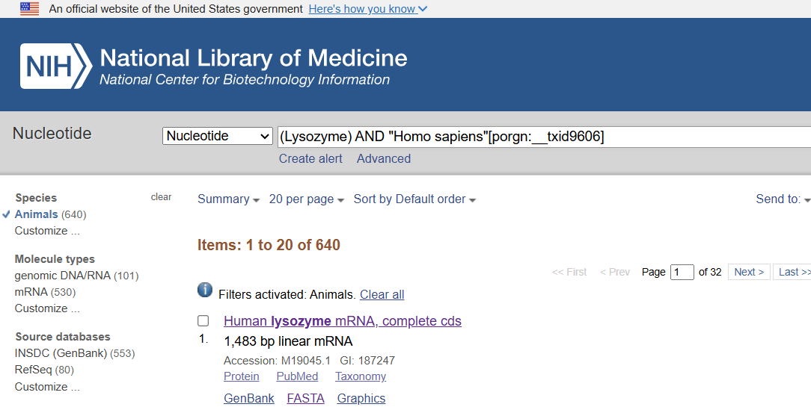
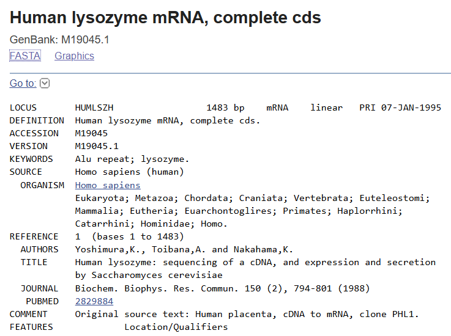

# Experiment 1: Database Observations

## Gene of Interest

**Gene:** LYZ  
**Protein:** Lysozyme C  
**Organism:** Homo sapiens

---

## 1. NCBI GenBank

### Observation

The NCBI Nucleotide database was searched for human lysozyme.

A human lysozyme mRNA record was identified with the following details:

- **Description:** Human lysozyme mRNA, complete cds
- **Accession:** M19045.1
- **Sequence length:** 1,483 bp
- **Organism:** Homo sapiens
- **Molecule:** mRNA

### Screenshot

---

## 2. UniProt

### Observation

The UniProt database was explored to obtain protein information for human lysozyme.

The following reviewed UniProt entry was identified:

- **UniProt ID:** P61626
- **Entry name:** LYSC_HUMAN
- **Protein:** Lysozyme C
- **Gene:** LYZ
- **Organism:** Homo sapiens
- **Protein length:** 148 amino acids
- **Status:** UniProtKB reviewed (Swiss-Prot)
- **Protein existence:** Evidence at protein level

The protein sequence was also examined.

### Screenshot

---

## 3. KEGG

### Observation

The KEGG database was explored to understand biological pathway information.

The **Glycolysis / Gluconeogenesis** pathway was identified:

- **Pathway ID:** map00010
- **Pathway:** Glycolysis / Gluconeogenesis
- **Class:** Metabolism; Carbohydrate metabolism

The pathway map was examined to understand the organization of metabolic reactions.

### Screenshot

---

## 4. Protein Data Bank (PDB)

### Observation

The Protein Data Bank was explored to examine available three-dimensional protein structures.

A structure with the following information was observed:

- **PDB ID:** 168L
- **Title:** Protein flexibility and adaptability seen in 25 crystal forms of T4 lysozyme
- **Organism:** Tequatrovirus T4
- **Macromolecule:** T4 lysozyme
- **Experimental method:** X-ray diffraction
- **Resolution:** 2.90 Å

**Note:** The observed PDB structure is T4 lysozyme and is not a human LYZ structure. It is therefore recorded as an example of a lysozyme-related structure available in PDB rather than as the structure of human Lysozyme C.

### Screenshot

---

## Overall Observation

Different biological databases were explored to understand the types of biological information they provide.

| Database | Information Observed |
|---|---|
| NCBI | Human LYZ mRNA sequence |
| UniProt | Human Lysozyme C protein information |
| KEGG | Glycolysis / Gluconeogenesis pathway |
| PDB | Three-dimensional structure of T4 lysozyme |

## Conclusion

The experiment demonstrated how different biological databases can be used to retrieve nucleotide sequences, protein information, biological pathways, and three-dimensional structural information.
